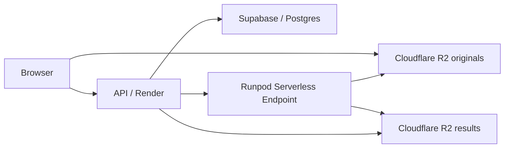

# Runpod 云端处理切换指南

目标：把“处理照片”从本机/临时链路切到 Runpod Worker，同时前端、用户、积分、项目数据继续使用现有 Supabase/Postgres 和 R2。

当前代码已经支持两条链路：

- 当前网站默认：`local-runninghub`，不设置 `METROVAN_TASK_EXECUTOR` 时继续使用，不影响线上。
- 正式云端：`runpod-native`，只有设置 `METROVAN_TASK_EXECUTOR=runpod-native` 才启用。

## 正式链路



## Runpod Worker 部署

1. 使用 `runpod-worker/` 作为镜像目录。
2. 在 Worker 镜像里加入真实处理脚本。
3. 设置 Worker 环境变量：

```text
METROVAN_R2_ENDPOINT=https://<account-id>.r2.cloudflarestorage.com
METROVAN_R2_BUCKET=metrovanai-production
METROVAN_R2_ACCESS_KEY_ID=...
METROVAN_R2_SECRET_ACCESS_KEY=...
METROVAN_R2_REGION=auto
METROVAN_PROCESSOR_COMMAND=python /app/process.py
METROVAN_REGEN_COMMAND=python /app/regenerate.py
```

`METROVAN_PROCESSOR_COMMAND` 必须把最终 JPG 写到 `METROVAN_OUTPUT_PATH`。

## API 切换环境变量

先在 staging / 新 Render 服务测试，不要直接改当前生产服务：

```text
METROVAN_TASK_EXECUTOR=runpod-native
METROVAN_RUNPOD_ENDPOINT_ID=<Runpod Endpoint ID>
METROVAN_RUNPOD_API_KEY=<Runpod API Key>
METROVAN_RUNPOD_MAX_IN_FLIGHT=5
METROVAN_RUNPOD_TIMEOUT_SECONDS=3600
METROVAN_RUNPOD_OBJECT_URL_EXPIRES_SECONDS=21600
```

R2 变量沿用现在的：

```text
METROVAN_OBJECT_STORAGE_ENDPOINT
METROVAN_OBJECT_STORAGE_BUCKET
METROVAN_OBJECT_STORAGE_ACCESS_KEY_ID
METROVAN_OBJECT_STORAGE_SECRET_ACCESS_KEY
METROVAN_OBJECT_STORAGE_REGION=auto
```

## 测试顺序

1. 新建 staging API 服务，接同一个 Supabase 测试项目或测试库。
2. 设置 `METROVAN_TASK_EXECUTOR=runpod-native`。
3. 上传 1 组 JPG，确认结果回到 R2 和项目结果区。
4. 上传 1 组 RAW，确认 Worker 能读取原片、处理并回传。
5. 测试重新改色，确认 `workflowMode=regenerate` 和 `colorCardNo` 生效。
6. 测试失败重试和积分回滚。
7. 再把生产 API 环境变量切到 `runpod-native`。

## 回滚

如果云端处理异常：

```text
METROVAN_TASK_EXECUTOR=local-runninghub
```

或者删除 `METROVAN_TASK_EXECUTOR`，重启 API 即可回到当前链路。

## 重要限制

`runpod-worker/handler.py` 是正式执行壳和输入输出契约。真实 HDR 合并、白平衡、AI 处理命令必须接到 `METROVAN_PROCESSOR_COMMAND`。没有该命令时，RAW-only 任务会失败，避免把未处理结果误当正式结果。
